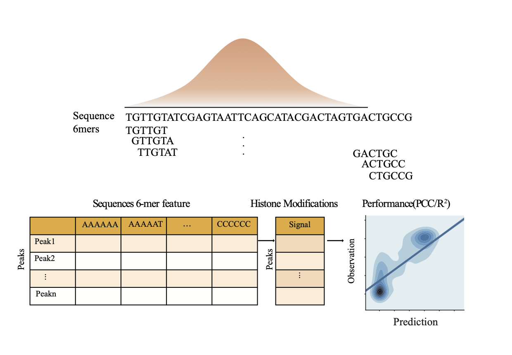
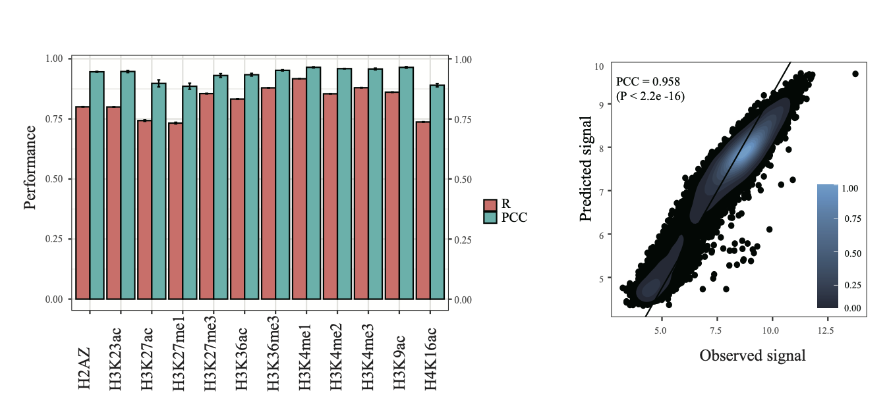
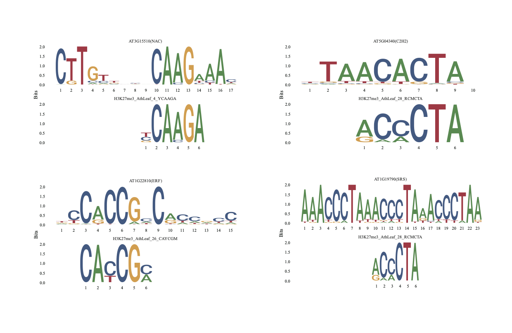

# Deciphering the regulatory code of histone modifications in plants
## Overview
Histone modifications play a critical role in the dynamic regulation of spatial-temporal gene expression. 
However, in plants, what genetic mechanisms determine the modification level of histone marks is still elusive. 
Using a machine learning approach, we performed a systematic and comprehensive study on the cis-regulatory grammar of 19 histone marks in Arabidopsis thaliana, rice, and maize.

## The schematic flowchart of our machine learning methods 


## Usage

### Predict histone modification levels
``` r
# The easiest way to predict histone modifications levels with DNA sequences using our R script:
source("R1_AthLeaf_predict_HMs.R")
peakKmerResReads.df <- getSeqFeature(peakFile=markPeakFile, k=6)
peakFeatures.df <- getMarkerReadsSignal(peakKmerResReads.df=peakKmerResReads.df,
                                             bamFile=bamFile,peakFile = markPeakFile)
AthLeafPerformance <- cv(peakKmerRes.df = peakFeatures.df)
```
### Plot the performance of HMs predictive model 

```r
library(ggpolt2)
source("R1_AthLeaf_predict_HMs.R")
AthLeafPerformance_R_PCC_plot <- getmarkersPerformance.Rsquared.melt1(AthLeafPerformance_R_PCC)
ggplot(AthLeafPerformance_R_PCC_plot, aes(x=Marker, y= value, fill=variable)) + 
    geom_bar(stat="identity", color="black", position=position_dodge()) +
    geom_errorbar(aes(ymin=value-sd, ymax=value+sd), width=.2, position=position_dodge(.9)) +
    labs(x = "Histone Marks",y = "Performance") + 
    theme(plot.title = element_text(hjust = 0.5)) +
    scale_y_continuous(sec.axis = dup_axis(name="Correlation")) +
    scale_fill_discrete(name="Type") + 
    theme(axis.text.x = element_text(angle=90, hjust=0.1, vjust=0.1))
AthLeafPerformances_obs_pre1 <- lapply(1:length(AthLeafPerformances_obs_pre), function(i) {
  marker <- gsub("(\\.bam)?_peaks\\.narrowPeak","",names(AthLeafPerformances_obs_pre)[i])
  AthLeafPerformances_obs_pre[[i]]$Marker <- marker
  AthLeafPerformances_obs_pre[[i]]
})
res <- data.frame()
for(i in 1:length(AthLeafPerformances_obs_pre1))  res <- rbind(res, AthLeafPerformances_obs_pre1[[i]])
ggplot(data = res, aes(x = observed,y = predicted)) + 
    xlab("Observed histone modification levels") +
    ylab("Predicted histone modification levels") +
    geom_point() +
    stat_density_2d(aes(fill = stat(nlevel)), geom = "polygon") +
    geom_abline(intercept=0,slope=1) +
    scale_fill_viridis_c() + facet_wrap(.~Marker, nrow = 3, scales = "free") +
    theme_bw()
```
### Extracting mark motifs

``` r
require(gtools)
require(Biostrings)
source("R5_PWM_1201.R")
labc <-getActiveVar(peakSignal.df=mark_pos_neg_KmerRes.df)
AthLeafAllLASSOImp[[i]] <- labc
aa1 <- getEnrichmentImp(LASSO.impAll=labc,peakFile=markPeakFile)
AthLeafAllEnrichmentImp[[i]] <- aa1
bb1 <- getMismatch_k_mers_list(KmerWeight=aa1$newKmerWeight,enrichment.imp=aa1$EF1_df)
AthLeafAllMismatch_k_mers_list[[i]] <- bb1
markPWMs <- getEachMarkPWMs(kmerList = bb1,KmerWeight = aa1$newKmerWeight)
write_meme(markPWMs, file=markmotif.meme)
```
### Visualize mark motifs and align them to known TF motifs


``` r
library(universalmotif)
H3K27me3_AthLeaf_4_YCAAGA <- H3K27me3meme
aa <- matrix(0,4,8)
bb <- matrix(0,4,3)
H3K27me3_AthLeaf_4_YCAAGA <- cbind(cbind(aa,H3K27me3meme[[4]]@motif),bb)
p1 <- list(athMeme[[310]]@motif,H3K27me3_AthLeaf_4_YCAAGA)
names(p1) <- c("AT3G15510(NAC)","H3K27me3_AthLeaf_4_YCAAGA")
ggseqlogo(p1,nrow = 2)
```

## Citation
Zhaohong Li1<sup>#</sup>, Dongwei Li<sup>#</sup>, Ye Li, Xiaoping Guo, Ruolin Yang<sup>*</sup>: Deciphering the regulatory code of histone modifications in plants. 2022